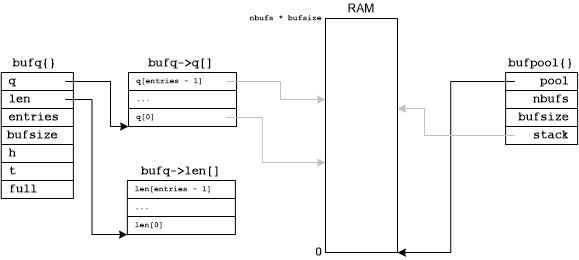

# *cppip*

*cppip* is an Internet protocol stack for embedded, real-time systems
written in C++.

*cppip* is specifically designed for statically managed networks that
use primarily UDP to pass application data.  Embedded, hard real-time
applications that make use of highly controlled Ethernet networks require
a protocol stack that is simple, high-performance, and verifiable.

*cppip* uses only the stack for dynamic memory during nominal operations.
Data structures are only allocated from the heap at initialization.

## Data Structures

The most basic data structure is the buffer, `buf_t`, that is simply
a pointer to a byte:

`typedef uint8_t *buf_t`

From this a buffer pool and a buffer queue are defined.

A buffer pool is a contiguous segment of memory that has been divided
into a contiguous list of fixed size buffers that are managed as a
stack.  A buffer queue is a First-In-First-Out (FIFO) queue of buffer
pointers.

The following figure illustrates the relationships between these
data structures:

After the bufpool memory is allocated, all of the buffers contained in
that memory are inserted into a stack data structure using a linked list
of addresses that are stored in the first few bytes of each buffer.
The use of a stack enables constant time insertion and removal operations
that are acceptable for hard real-time applications.

There is also a buffer queue that manages an array of buffer pointers in
a First-In-First-Out queue.  No buffer memory is allocated as part of this
data structure, it manages buffer pointers only.  The queue head and tail
are indexes into this buffer pointer array that advance in a circular
manner, i.e. when a head or tail index reaches the end of the array, it
returns to the first buffer pointer at the beginning of the array.  Buffer
pointers are inserted at the tail of the queue and removed from the head
of the queue.
