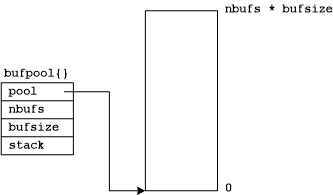

# *cppip*

*cppip* is an Internet protocol stack for embedded, real-time systems
written in C++.

*cppip* is specifically designed for statically managed networks that
use primarily UDP to pass application data.  Embedded, hard real-time
applications that make use of highly controlled Ethernet networks require
a protocol stack that is simple, high-performance, and verifiable.

*cppip* uses only the stack for dynamic memory during nominal operations.
Data structures are only allocated from the heap at initialization.

## Data Structures

The most basic data structure is the buffer that is simply a pointer to
a byte:

`typedef uint8_t *buf_t`

#### Buffer Pool

From this a buffer pool is created.  A buffer pool is a contiguous segment
of memory that has been divided into a contiguous set of fixed size buffers
and those buffers are then all inserted into a stack.  The following
figure illustrates the memory associated with the buffer pool.  The pool
element tracks the location of a dynamically allocated segment of memory
that is nbufs * bufsize in length.

After the bufpool memory is allocated, all of the buffers contained in
that memory are inserted into a stack data structure using a linked list
of addresses that are each stored in the first few bytes of the buffer.
The use of a stack enables constant time insertion and removal operations
that are acceptable for hard real-time applications.

#### Buffer Queue

There is also a buffer queue that manages a set of buffer pointers in a
First-In-First-Out queue.
